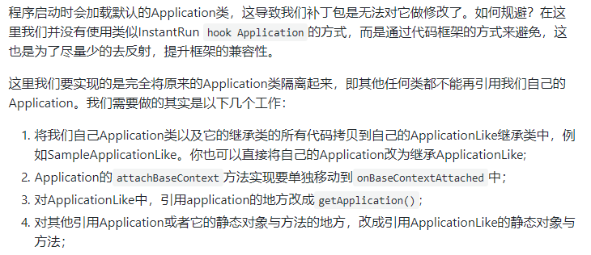
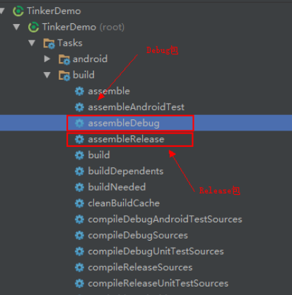
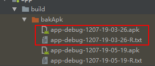
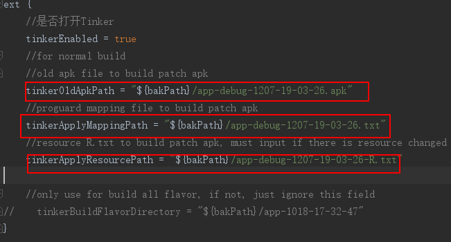
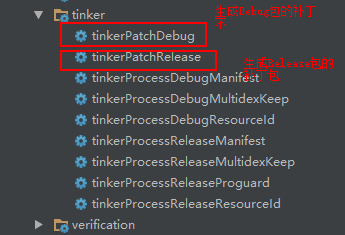
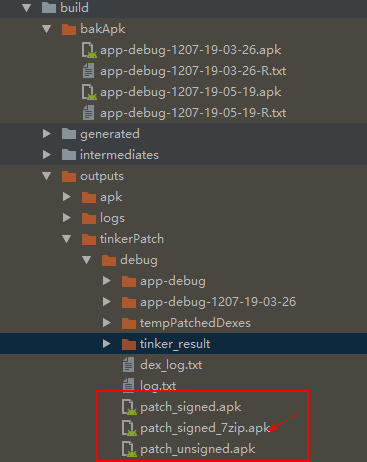
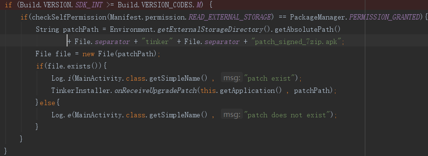
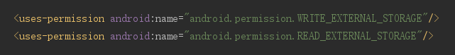

##官方WIKI
https://github.com/Tencent/tinker/wiki

##Tinker接入指南
https://github.com/Tencent/tinker/wiki/Tinker-%E6%8E%A5%E5%85%A5%E6%8C%87%E5%8D%97

###个人总结:

基本使用

1.添加gradle依赖
项目build.gradle中添加,tinker-patch-gradle-plugin
```gradle
buildscript {
    dependencies {
        classpath ('com.tencent.tinker:tinker-patch-gradle-plugin:1.9.1')
    }
}
```

2.app build.gradle中添加Tinker的库依赖,以及应用tinker插件
```gradle
dependencies {
	//可选，用于生成application类 ,这个以来只是用来生成Application 类代码的
	provided('com.tencent.tinker:tinker-android-anno:1.9.1')
    //tinker的核心库
    compile('com.tencent.tinker:tinker-android-lib:1.9.1') 
}
//apply tinker插件
apply plugin: 'com.tencent.tinker.patch'
```

3.配置ApplicationLike

详见:https://github.com/Tencent/tinker/wiki/Tinker-%E8%87%AA%E5%AE%9A%E4%B9%89%E6%89%A9%E5%B1%95



4.gradle 参数配置
参数配置详解：https://github.com/Tencent/tinker/wiki/Tinker-%E6%8E%A5%E5%85%A5%E6%8C%87%E5%8D%97

5.生成基准APK

生成apk,对应的R文件



如果开启混淆还会有mapping文件



6.将生成基准包、R文件和mapping文件（如果有）的名称填写到gradle配置文件



7.生成Patch包



生成Patch包的路径




8.补丁包如何安装？
①：将补丁包下载到指定目录，（结合具体项目是实现）

②：使用API：TinkerInstaller.onReceiveUpgradePatch(context,patch)



注意：开启文件读写权限



##高级


